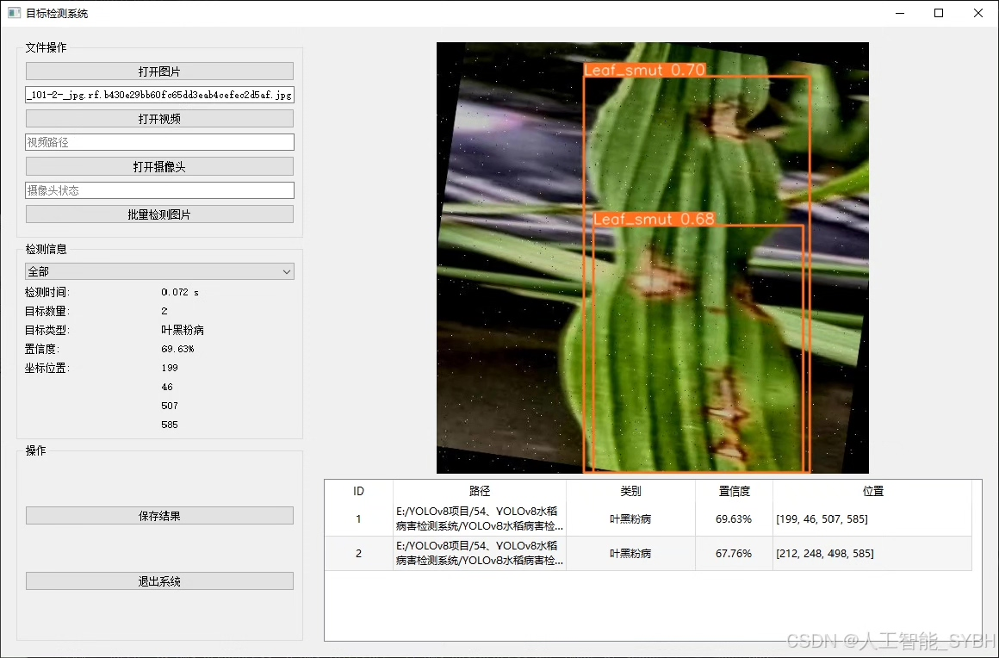
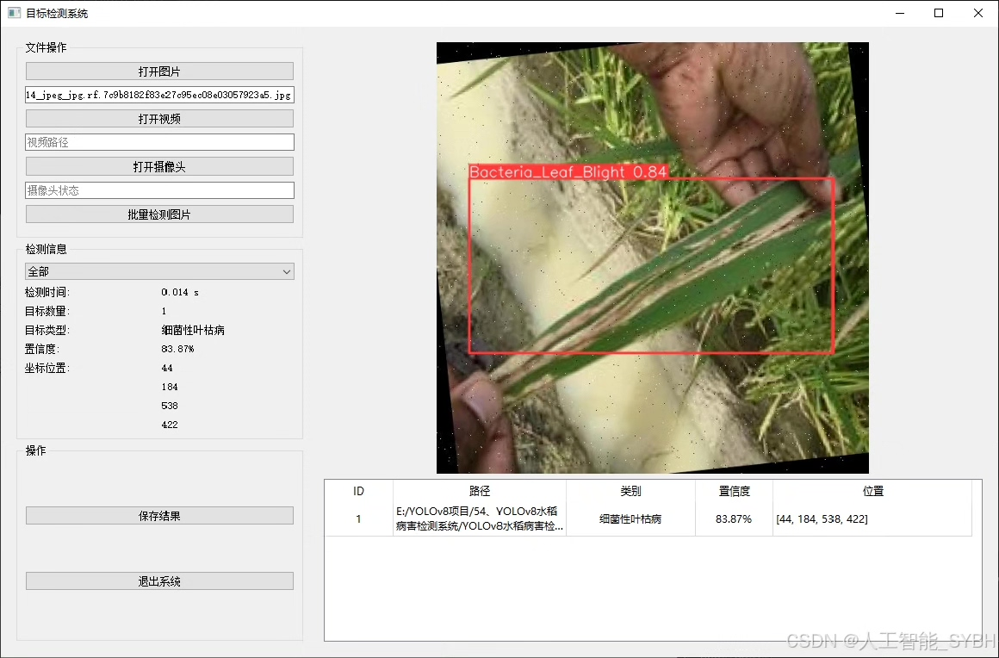
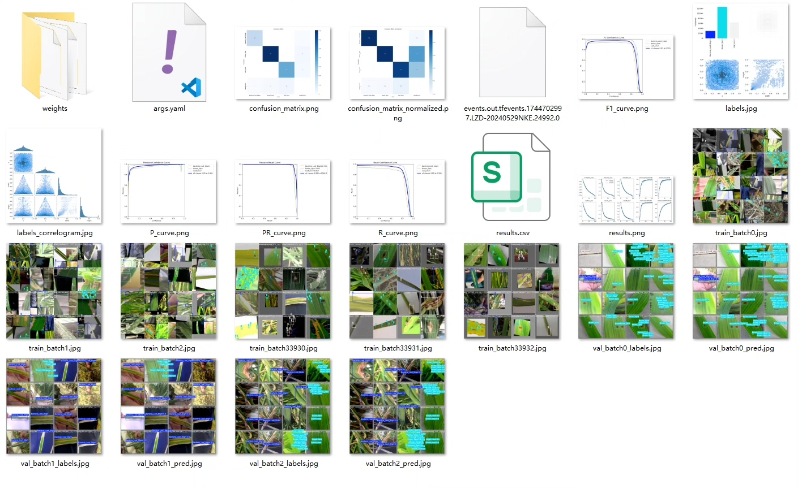
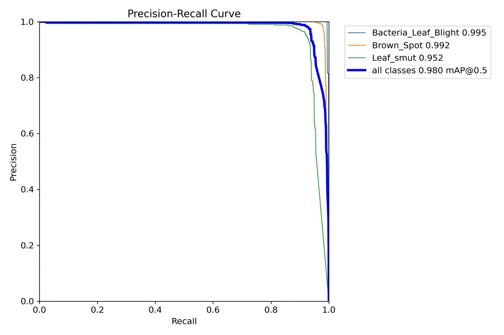
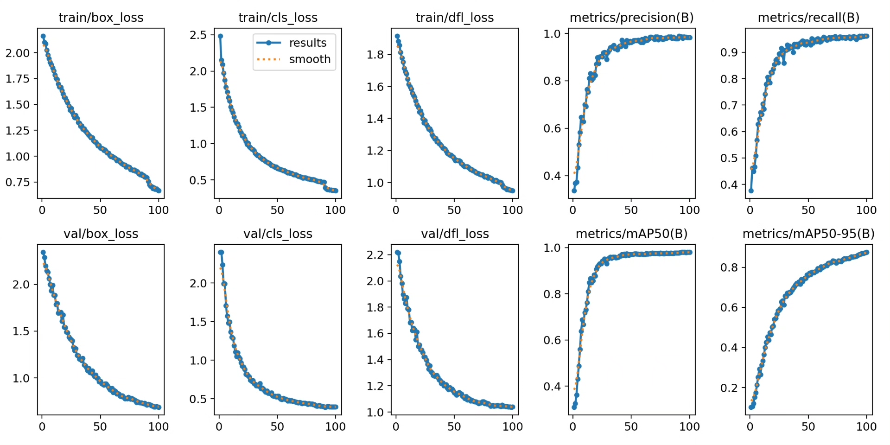
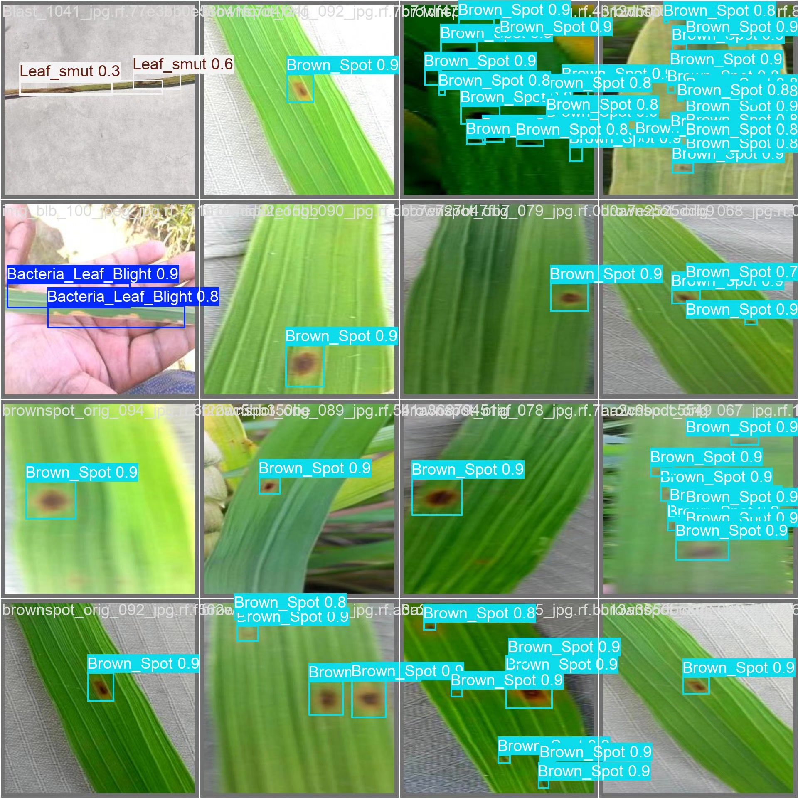
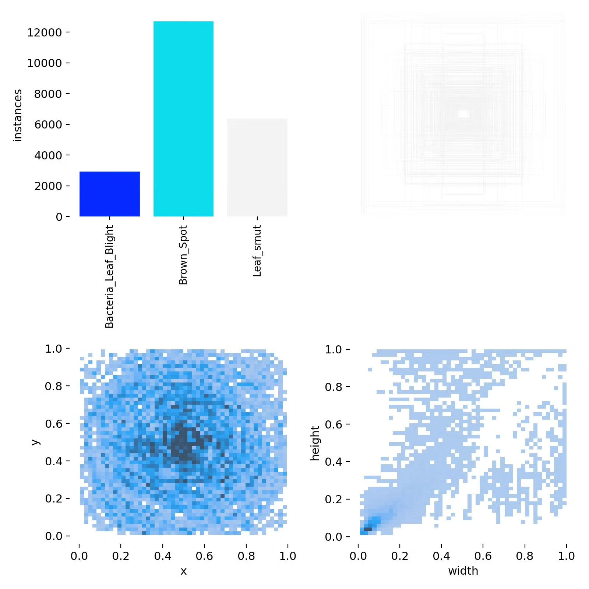
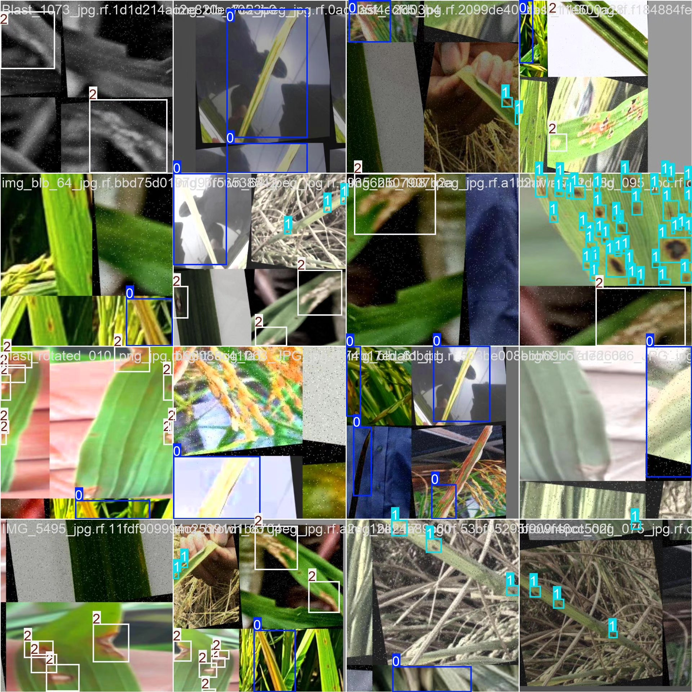

# Based on YOLOv8 deep learning for rice disease detection system (YOLOv8+Y)

## Body

Based on the advanced YOLOv8 object detection algorithm, this project has developed a set of intelligent identification systems specifically for rice diseases. The system can accurately detect and classify three common rice diseases: bacterial leaf blight (Bacteria_Leaf_Blight), brown spot (Brown_Spot), and leaf smut (Leaf_smut). The project uses a large-scale professional dataset for training and validation, with a training set containing 6030 labeled images, a validation set of 409, and a test set of 276, ensuring the model's generalization ability and reliability. This system can process rice leaf images captured in the field in real time, quickly locate diseased areas, and accurately classify them, providing farmers with timely disease diagnosis information. Compared to traditional manual detection methods, this system significantly improves detection efficiency and accuracy, reduces the risk of misdiagnosis and missed diagnoses, and helps achieve early detection and precise prevention of rice diseases.

The company's products have obtained YOLO official commercial license certification.

We provide after-sales service.

After payment, we will provide WeChat IDs for any questions.

Environmental configuration: We will provide an instructional tutorial for environmental configuration, and WeChat will provide answers.

Remote installation services: If you need remote configuration, an additional fee of 69 is required,
failure in configuration will result in all fees being refunded (only the installation fee is refundable for older computers)

Retraining datasets: After setting up the environment, you can train on your own computer.
If you need us to retrain, just pay 69 + computing power fees (2.5 yuan/hour)

## Images

## Payment

Here is a pay link on Stripe ( https://buy.stripe.com/3cs8yP7sY87d0vu9AB ). Please contact me lonlonago@foxmail.com after funding $89, and I will send you a complete data files , thank you!

